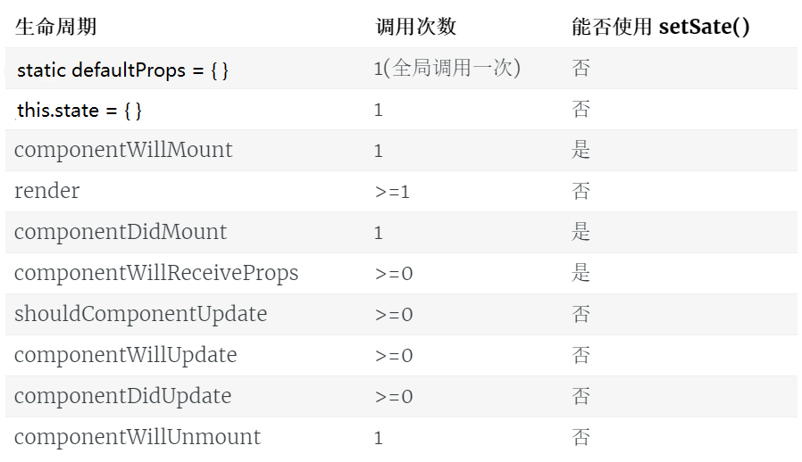

### 组建的创建
#### 1. 构造函数方法
```jsx
//函数名必须为大写
function Hello () { 
 // return null 
 return <div>Hello 组件</div>
}
```

#### 2. 使用class关键字创建组件
> ES6 中 class 关键字，是实现面向对象编程的新形式；

##### 了解ES6中 class 关键字的使用

1. class 中 `constructor` 的基本使用
2. 实例属性和实例方法
3. 静态属性和静态方法
4. 使用 `extends` 关键字实现继承

##### 基于class关键字创建组件

1. 最基本的组件结构：

   ```jsx
   // 如果要使用 class 定义组件，必须 让自己的组件，继承自 React.Component
   class 组件名称 extends React.Component {
       // 在 组件内部，必须有 render 函数,作用：渲染当前组件对应的 虚拟DOM结构
       render(){
           // render 函数中，必须 返回合法的 JSX 虚拟DOM结构
           return <div>这是 class 创建的组件</div>
       }
   }
   ```
   
####  两种创建组件方式的对比

> 注意：使用 class 关键字创建的组件，有自己的私有数据（this.state） 和 生命周期函数；
>
> 注意：使用 function 创建的组件，只有props，没有自己的私有数据和 生命周期函数；

1. 用**构造函数**创建出来的组件：叫做“无状态组件”【无状态组件今后用的不多】
2. 用**class关键字**创建出来的组件：叫做“有状态组件”【今后用的最多】
3. 什么情况下使用有状态组件？什么情况下使用无状态组件？
   + 如果一个组件需要有自己的私有数据，则推荐使用：class创建的有状态组件；
   + 如果一个组件不需要有私有的数据，则推荐使用：无状态组件；
   + React官方说：无状态组件，由于没有自己的state和生命周期函数，所以运行效率会比 有状态组件稍微高一些；

> 有状态组件和无状态组件之间的**本质区别**就是：有无state属性、和 有无生命周期函数；

4. 组件中的 `props` 和 `state/data` 之间的区别
   + props 中的数据都是外界传递过来的；
   + state/data 中的数据，都是组件私有的；（通过 Ajax 获取回来的数据，一般都是私有数据）；
   + props  中的数据都是只读的；不能重新赋值；
   + state/data 中的数据，都是可读可写的；

#### 3. React 中绑定事件的注意点

1. 事件的名称都是React的提供的，因此名称的首字母必须大写`onClick`、`onMouseOver`

2. 为事件提供的处理函数，必须是如下格式

   ```
   onClick= { function }
   ```

3. 用的最多的事件绑定形式为：

   ```jsx
   <button onClick={ () => this.show('传参') }>按钮</button>

   // 事件的处理函数，需要定义为 一个箭头函数，然后赋值给 函数名称
   show = (arg1) => {
       console.log('show方法' + arg1)
   }
   ```

4. 在React中，如果想要修改 state 中的数据，推荐使用 `this.setState({ })`


#### 4. 绑定文本框与state中的值（单向数据流）

1. 在 Vue 中，默认提供了`v-model`指令，可以很方便的实现 `数据的双向绑定`；

2. 但是，在 React 中，默认只是`单向数据流`，也就是 只能把 state 上的数据绑定到 页面，无法把 页面中数据的变化，自动同步回 state ； 如果需要把 页面上数据的变化，保存到 state，则需要程序员手动监听`onChange`事件，拿到最新的数据，手动调用`this.setState({  })` 更改回去；

3. 案例：

   ```jsx
   <input type="text" value={this.state.msg} onChange={this.textChanged}/>

    // 响应 文本框 内容改变的处理函数
     textChanged(e) {
       this.setState({
         msg: this.target.value
       })
     }
   ```

   ​
#### 5. 组件的生命周期

- 生命周期的概念：每个组件的实例，从 创建、到运行、直到销毁，在这个过程中，会出发一些列 事件，这些事件就叫做组件的生命周期函数；

- React组件生命周期分为三部分：

  - **组件创建阶段**：特点：一辈子只执行一次

  > componentWillMount: 
  > render：
  > componentDidMount: 

  - **组件运行阶段**：按需，根据 props 属性 或 state 状态的改变，有选择性的 执行 0 到多次

  > componentWillReceiveProps:
  > shouldComponentUpdate:
  > componentWillUpdate: 
  > render: 
  > componentDidUpdate: 

  - **组件销毁阶段**：一辈子只执行一次

  > componentWillUnmount: 

[vue中的生命周期图](https://cn.vuejs.org/v2/guide/instance.html#生命周期图示)
[React Native 中组件的生命周期](http://www.race604.com/react-native-component-lifecycle/)


#### defaultProps

> 在组件创建之前，会先初始化默认的props属性，这是全局调用一次，严格地来说，这不是组件的生命周期的一部分。在组件被创建并加载候，首先调用 constructor 构造器中的 this.state = {}，来初始化组件的状态。

React生命周期的回调函数总结成表格如下：


组件生命周期的执行顺序：

1. **Mounting：**
   - constructor()
   - componentWillMount()
   - render()
   - componentDidMount()
2. **Updating：**
   - componentWillReceiveProps(nextProps)
   - shouldComponentUpdate(nextProps, nextState)
   - componentWillUpdate(nextProps, nextState)
   - render()
   - componentDidUpdate(prevProps, prevState)
3. **Unmounting：**
   - componentWillUnmount()

#### 6. 通过Counter计数器的小案例 - 了解生命周期函数

1. 给 `props` 属性提供默认值 和 进行类型校验，需要先运行`cnpm i prop-types --save`

2. 给组件的 `props` 提供默认值

   ```js
     // 为组件提供 默认的 props 属性值
     static defaultProps = {
       initcount: 0 // 默认值为0    如果用户没有传递 ，则 默认就是0； 如果用户传递了，则 以用户传递的为准
     }
   ```

3. 给组件的 `props` 进行类型校验

   ```js
     // 3. 进行 props 属性的类型校验,   static propTypes = {}  是固定写法
     static propTypes = {
       initcount: PropTypes.number.isRequired // 规定 外界在传递 initcount 的时候，必须是 number 值类型，否则 ，会在终端报警告
       // isRequired 表示 这个 props 属性值 是必须要传递的
     }
   ```

   ​